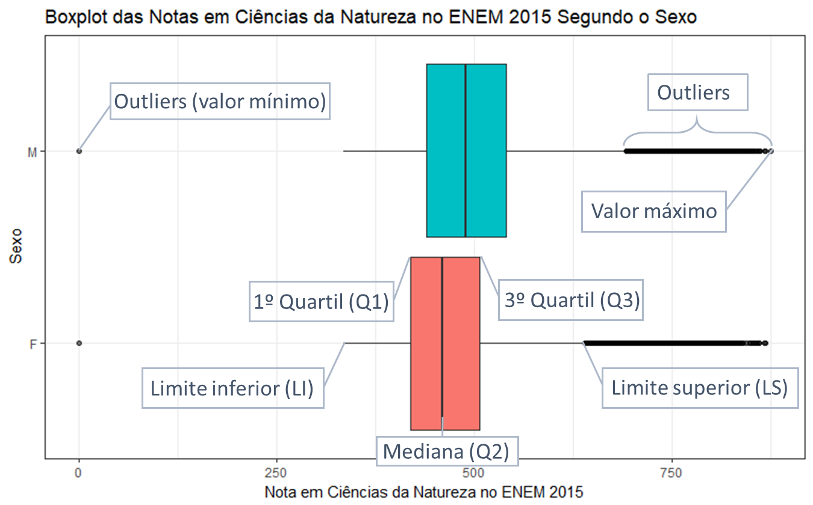

# Boxplot

O boxplot, ou gráfico de caixa, recebe esse nome pelo seu formato. Sua aparência retangular e com hastes não é intuitiva de interpretar. É necessário entender sua estrutura. Para isto, vamos utilizar o boxplot das notas em ciências da natureza no ENEM 2015 segundo o sexo, como exibido na figura abaixo. A seguir, vamos explicar algumas definições e detalhar cada uma das componentes de um boxplot.

## Conhecendo a estrutura e suas quantidades
- **Quartil:** Um quartil é um dos três valores que dividem algo inteiro em quatro partes iguais. No caso de uma amostra ou população, o quartil divide os dados ordenados em quatro intervalos com o mesmo número de observações.

- **Amplitude interquartil (AIQ):** É a diferença entre o terceiro e o primeiro quartil. Esse valor nos informa sobre a dispersão dos valores observados.

- **Intervalo interquartil:** é o intervalo que contém os valores entre o primeiro e o terceiro quartil. Note que 50% dos valores centrais observados se encontram nesse  intervalo e que esse intervalo é o tamanho da caixa.

- **1º quartil (Q1):** Os valores abaixo deste valor correspondem à 25% dos dados.

- **2º quartil ou Mediana (Q2):** O quartil que divide os dados pela metade é conhecido como mediana.

- **3º quartil (Q3):** Os valores abaixo deste valor correspondem à 75% dos dados.

- **Limite inferior (LI):** O limites inferior é determinado pela fórmula: LI = Q1 - k*AIQ, em que k é um número real. Optamos por k = 1,5, pois este valor capta mais de 99% dos dados. Portanto, o cálculo do limite inferior ficou:

    LI = Q1 - 1,5*AIQ
    
- **Limite superior (LS):** De forma similar ao limite inferior, obtemos o limite superior através da seguinte fórmula:

    LS = Q3 + 1,5*AIQ
    
- ***Outliers*:** São valores atípicos, ou seja, muito distantes dos demais valores observados. A detecção de *outliers* é muito importante, pois esses valores raros nos dados causam tendências em parâmetros e estimadores. Imagine que desejamos obter a média de . Os *outliers* podem ser muito menores ou muito maiores que os demais valores observados e a identificação é feita baseada nos limites inferior e superior. Portanto, se um um valor é menor que o limite inferior ou é maior que o limite superior, então ele é um outlier.

## Interpretação:

Inicialmente identificamos que o horizontal vertical representa as notas observadas e o eixo vertical a identificação do grupo. Observe que o boxplot do sexo masculino está acima do boxplot do sexo feminino e que a caixa e as hastes são mais compridas em relação ao grupo feminino. O grupo feminino possui 75% das observações um pouco acima de 500 pontos e os valores raros (exceto zero) variam entre 625 e 875 pontos, aproximadamente. O grupo masculino tem metade das observações próximas de 500 pontos, o primeiro quartil do grupo está próximo da mediana do grupo feminino, o limite superior ultrapassa 680 pontos e seus valores raros variam deste ponto até cerca de 875 pontos. Portanto, o grupo masculino teve melhor desempenho na prova de ciências da natureza no ENEM 2015. Para valores exatos, consulte a tabela auxiliar.

**Obs.:** Ambos os grupos possuem *outliers*, veja que a nota zero ocorre nos dois grupos, mas é raro entre as notas observadas. Existem sequências de *outliers* imediatamente após os limites superiores. O grande número de *outliers* sequenciais e sobrepostos (a cor mais escura indica que há sobreposição de pontos) deu essa aparência de uma haste mais espessa. Perceba que os *outliers* são valores próximos um dos outros e que possuem mais de uma observação, no entanto são classificados como valores raros. Isso ocorre devido ao grande número de observações que temos, o que significa que os valores encontrados entre os limites inferior e superior possuem muito mais casos. Desta forma, os valores mais extremos tornam-se casos raros. 
