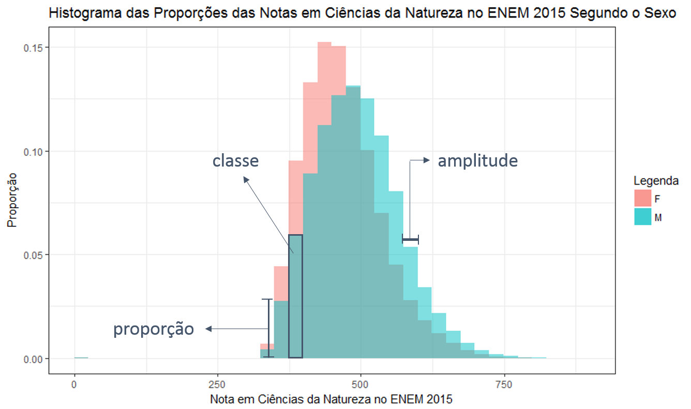

# Histograma
 
 O histograma se assemelha a um gráfico de colunas, mas sua estrutura informa mais do que a frequência dos dados. A estrutura de um histograma é exibida na figura abaixo, em que temos os mesmos dados das notas em ciências da natureza no ENEM 2015 por sexo utilizados para produzir os boxplots da aba "como interpretar um boxplot". Observe que há dois grupos de colunas, um rosa e um azul, representando o sexo feminino e o sexo masculino, respectivamente. Cada grupo de colunas é um histograma. Eles estão sobrepostos e a cor mais escura é a interseção entre eles. 
 

## Conhecendo a estrutura
As classes são as colunas do histograma. Cada classe representa um intervalo dos dados. Não há espaçamento entre as classes, pois o eixo horizontal representa o intervalo onde os valores da variável são observados. Portanto, o fim de uma classe é o início da classe seguinte. É comum que o eixo vertical do histograma represente a frequência ou a densidade dos dados. Neste trabalho optamos pelo uso da proporção no eixo vertical, pois desta forma é possível fazer comparação entre grupos de tamanhos diferentes. As amplitudes das classes de um histograma podem variar e a área do retângulo formado é proporcional à unidade de medida do eixo vertical. Optamos pelo uso de amplitudes iguais nas classes, pois com a base igual podemos olhar somente para altura do retângulo como a unidade de medida escolhida no eixo vertical. 

## Interpretação:

Tendo os eixos e grupos identificados, vemos que o histograma do sexo masculino se encontra mais à direita que o histograma do sexo feminino, alcançando notas mais altas e com frequências maiores. Entre 0 e 25 pontos e entre 475 e 500 pontos a proporção entre os sexos é próxima. Entretanto, o histograma do sexo feminino tem maiores proporções nas classes que antecedem 475 pontos. Consequentemente, o sexo masculino apresenta maiores proporções nas classes posteriores, desta forma, constatamos que o sexo masculino teve melhor desemprenho nas notas de ciências da natureza no ENEM 2015. Uma observação é o vazio entre a primeira e a segunda colunas a aparecerem entre 0 e 25 pontos e 325 e 350 pontos. Note que o histograma não ignora a ausência de observações entre 25 e 325 pontos, ele mantém o eixo horizontal em sua sequência. Perceba que no histograma podemos ver que valores acima de 750 e entre zero e 25 têm uma proporção muito baixa. Isso pode ser um indicativo de outliers e podemos confirmar vendo o boxplot correspondente.
